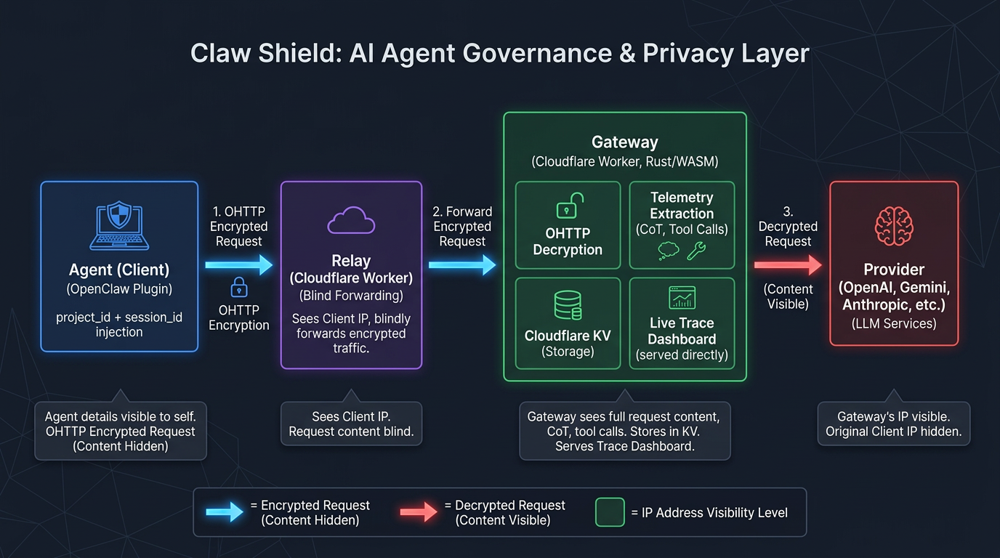
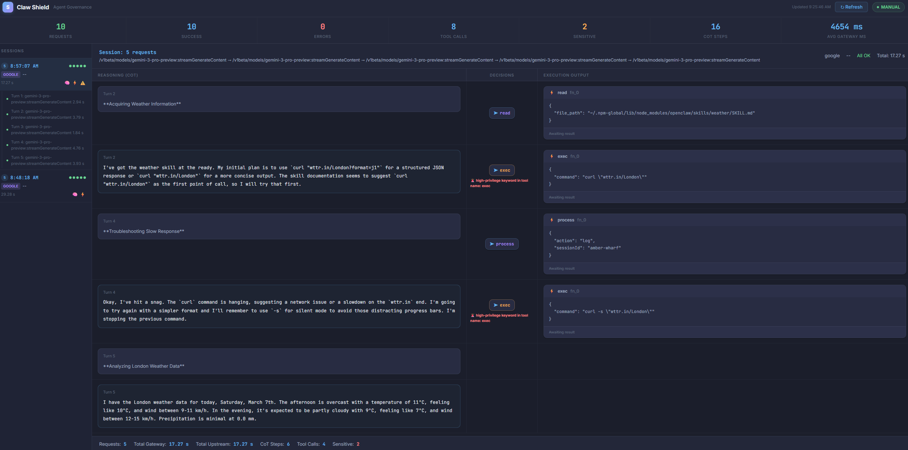

<p align="center">
  
</p>

<h1 align="center">Claw Shield</h1>

<p align="center">
  <strong>The governance layer for AI agents.</strong><br/>
  Monitor reasoning. Audit tool calls. Secure the loop.
</p>

<p align="center">
  <a href="#quick-start">Quick Start</a> ·
  <a href="#live-trace-dashboard">Dashboard</a> ·
  <a href="#how-it-works">Architecture</a> ·
  <a href="#roadmap">Roadmap</a>
</p>

---

## The Problem

AI agents are powerful — they reason, plan, and take actions on your behalf. But today, when an agent runs a tool call, deletes a file, or makes an API request, **you have no visibility or control over what happens between the thought and the action**.

Claw Shield sits between your agent and the outside world. It captures every chain-of-thought step, every tool call decision, and every execution result — giving you a real-time, auditable trace of everything your agent does.

## What Claw Shield Does

### 🔍 Agent Monitoring — *shipped*

See what your agent is thinking and doing, in real time.

- **Reasoning Capture** — Intercepts `reasoning_content` from streaming model responses (SSE) and extracts chain-of-thought steps as they happen.
- **Tool Call Auditing** — Logs every `tool_call` the model decides to make: function name, parameters, and sensitivity flags.
- **Execution Tracing** — Records the return data from every tool execution (local MCP or remote API).
- **Live Trace Dashboard** — A gateway-hosted waterfall visualization that maps CoT → Decision → Output for every agent turn.

>  

### 🔒 Privacy-Preserving Routing — *shipped*

All traffic flows through an [OHTTP](https://www.rfc-editor.org/rfc/rfc9458.html) (Oblivious HTTP) relay-gateway architecture:

- **Relay** sees who you are, but not what you send.
- **Gateway** sees what you send, but not who you are.
- Providers see relayed traffic — no direct fingerprint tied to your identity or tooling.

### 🛡️ Risk Blocking — *coming soon*

Gateway-level blocklists for high-risk operations:

- Define rules for dangerous tool calls (e.g., `rm -rf`, credential access, arbitrary code execution).
- Block or alert in real-time before the action reaches the downstream API.
- Configurable per-project policies.

### 📊 Agent Analytics — *coming soon*

Turn telemetry into actionable insights:

| Metric | What it measures |
|---|---|
| **Intent Drift** | How well the agent's CoT goal matches the actual tool call parameters |
| **Token Burn Rate** | CoT token consumption relative to task progress |
| **Block Rate** | Frequency of high-risk operations caught and intercepted by the gateway |

- Periodic risk reports and performance recommendations.
- Help agent developers identify inefficiencies and safety gaps.

## Live Trace Dashboard

The dashboard is hosted on the gateway — no local storage, no client-side state. Just open the URL with your project ID.

Each session shows the full agent turn as a **three-column waterfall**:

| Left | Middle | Right |
|---|---|---|
| **Reasoning (CoT)** — the model's chain-of-thought steps | **Decisions** — tool calls triggered by each reasoning step | **Execution Output** — return data from each tool call |

CoT steps that trigger a tool call are visually aligned with their corresponding decision and output at the same row height. Steps that don't trigger a decision show empty middle and right columns — so you can see the full reasoning flow alongside only the actions that were taken.

## How It Works

```
┌──────────┐     ┌──────────┐     ┌──────────────────┐     ┌──────────┐
│  Agent   │──── │  Relay   │──── │     Gateway      │──── │ Provider │
│ (Client) │     │          │     │ ┌──────────────┐ │     │ (OpenAI, │
│          │ ────│          │──── │ │  Telemetry   │ │──── │  Gemini, │
│          │     │          │     │ │  + Dashboard │ │     │  etc.)   │
└──────────┘     └──────────┘     │ └──────────────┘ │     └──────────┘
                                  └──────────────────┘
```

1. **Client plugin** intercepts outbound model requests, wraps them in OHTTP, and injects a `project_id` + `session_id`.
2. **Relay** (Cloudflare Worker) forwards encrypted traffic — it never sees the payload.
3. **Gateway** (Cloudflare Worker, Rust/WASM) decrypts, extracts telemetry (CoT, tool calls, results), stores traces in KV, and forwards to the provider.
4. **Dashboard** is served directly from the gateway — filter by project, drill into sessions, inspect the full reasoning-to-action trace.

## Providers

| Status | Provider |
|---|---|
| ✅ Verified | Google Gemini, OpenAI |
| 🧩 Supported | Anthropic, OpenRouter, Mistral, Groq |

> *Verified* = end-to-end tested. *Supported* = routing and auth logic implemented.

## Quick Start

### Install

```bash
curl -fsSL https://raw.githubusercontent.com/xinxin7/claw-shield/main/install.sh | bash
```

> **Prerequisites:** [OpenClaw](https://openclaw.ai) installed and running, `git`, `node`, `npm`.

<details>
<summary>Manual install (WSL / Linux / macOS)</summary>

```bash
# Clone
git clone --depth 1 https://github.com/xinxin7/claw-shield.git /tmp/claw-shield

# Install plugin
EXT="$HOME/.openclaw/extensions/claw-shield"
rm -rf "$EXT"
cp -r /tmp/claw-shield/client "$EXT"
cd "$EXT" && npm install --omit=dev

# Restart OpenClaw
systemctl --user restart openclaw-gateway.service   # Linux
# or: openclaw gateway restart                      # macOS
```

</details>

### Verify

```bash
curl http://127.0.0.1:18789/api/plugins/claw-shield/status
```

You should see:

```json
{ "ok": true, "status": "You're protected", "dashboardUrl": "https://..." }
```

### Open Dashboard

The status response includes a `dashboardUrl`. Open it in your browser to see the live trace waterfall for your project.

## Repository Layout

```
claw-shield/
├── client/          # OpenClaw plugin — OHTTP client, request interception
│   ├── index.ts
│   ├── openclaw.plugin.json
│   └── src/
│       └── ohttp-shield.plugin.ts
├── relay/           # Cloudflare Worker — OHTTP relay (sees who, not what)
│   └── index.js
├── gateway/         # Cloudflare Worker — OHTTP gateway (sees what, not who)
│   └── src/
│       ├── lib.rs           # Core OHTTP + routing logic
│       ├── telemetry.rs     # CoT / tool call extraction + KV storage
│       └── dashboard.html   # Live Trace Dashboard SPA
└── install.sh       # One-line installer
```

## Roadmap

- [x] OHTTP relay-gateway privacy routing
- [x] Chain-of-thought capture (OpenAI, Anthropic, Gemini)
- [x] Tool call + execution result logging
- [x] Gateway-hosted Live Trace Dashboard
- [x] Session grouping (multi-request agent turns)
- [x] Sensitivity detection for dangerous tool calls
- [ ] Gateway-level blocklists and real-time risk blocking
- [ ] Configurable per-project security policies
- [ ] Intent Drift / Token Burn Rate / Block Rate analytics
- [ ] Periodic risk reports and optimization recommendations
- [ ] Support for additional agent frameworks beyond OpenClaw

## Vision

Claw Shield is building toward becoming a foundational **governance and security layer** for the AI agent ecosystem.

As agents become more autonomous — browsing the web, writing code, calling APIs, managing infrastructure — the gap between *what agents can do* and *what humans can observe and control* is growing fast.

We believe every agent deployment needs:

- **Transparency** — full visibility into reasoning and actions.
- **Accountability** — auditable traces for every decision.
- **Control** — the ability to block risky actions before they execute.
- **Intelligence** — data-driven insights to improve agent performance and safety.

Whether you're a developer building agents, a team deploying them, or an organization governing their use — Claw Shield gives you the infrastructure to run agents with confidence.

## License

[MIT](./LICENSE)
